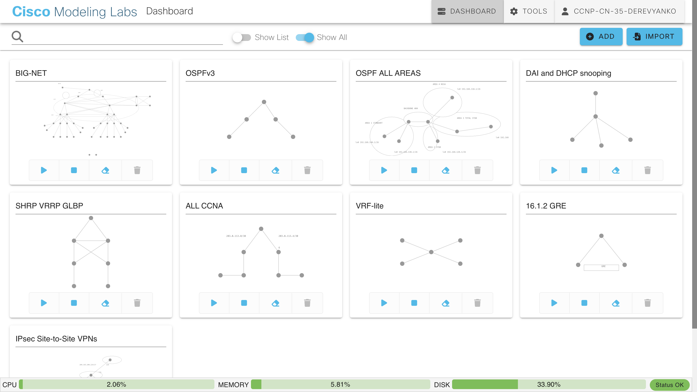

# 🚀 Cisco CML Network Labs Portfolio

This repository contains a collection of Cisco Modeling Labs (CML) scenarios built to simulate real-world enterprise networking environments.

The goal of this project is to continuously improve routing, switching, security, and VPN design skills while practicing troubleshooting and architecture thinking.

---

## 🖥 Lab Collection Overview

---

## 📂 Lab Scenarios Included

### 🔹 BIG-NET
Large-scale topology simulation with multiple interconnected routers and dynamic routing.

### 🔹 OSPFv3
IPv6 dynamic routing implementation and adjacency validation.

### 🔹 OSPF – All Areas
Multi-area OSPF design including backbone area and area types.

### 🔹 DAI & DHCP Snooping
Layer 2 security mechanisms:
- DHCP Snooping
- Dynamic ARP Inspection

### 🔹 FHRP (HSRP / VRRP / GLBP)
First Hop Redundancy Protocol comparison and configuration scenarios.

### 🔹 ALL CCNA
Complete routing & switching lab covering:
- VLAN
- Inter-VLAN routing
- OSPF
- Static routing
- NAT

### 🔹 VRF-Lite
Traffic segmentation and routing isolation using VRF-Lite.

### 🔹 GRE
Generic Routing Encapsulation tunnel configuration and verification.

### 🔹 IPsec Site-to-Site VPN
Classic crypto map–based IPsec VPN:
- IKEv1
- AES-256
- SHA256
- PFS group14
- Multi-subnet encryption
- Phase 1 & Phase 2 troubleshooting

---

## 🛠 Skills Practiced

- OSPF (single-area & multi-area)
- IPv6 routing (OSPFv3)
- Layer 2 security
- First-hop redundancy
- GRE tunneling
- IPsec VPN (Phase1 / Phase2)
- VRF segmentation
- Network troubleshooting methodology
- Cisco CLI configuration
- Verification using show/debug commands

---

## 🎯 Objective

The purpose of this repository is not only to configure technologies but to:

- Understand protocol behavior
- Troubleshoot negotiation failures
- Validate design decisions
- Simulate enterprise deployment scenarios

---

## 📈 Continuous Improvement

New labs will be added covering:

- BGP
- MPLS basics
- Network automation (Python / Ansible)
- Cloud networking integration
- Advanced IPsec & IKEv2
